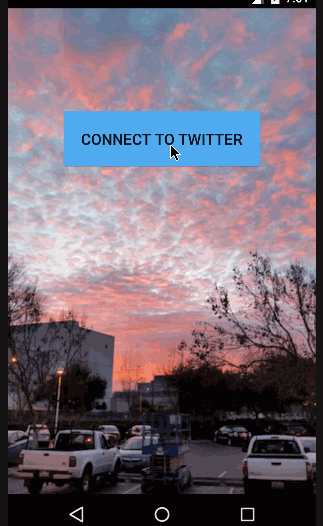

# Simple Tweets Redux - A Tweeter Experience
A little more than a simple Tweeter client with ability to read and compose tweets. With the Redux version you can now see Mentions, Profile page and go into other users' profile pages.

External libraries used:
- [RestClientTemplate](https://github.com/codepath/android-rest-client-template)
- [Android Asynchronous Http Client](http://loopj.com/android-async-http/)
- [Picasso](http://square.github.io/picasso/)
- [ActiveAndroid](http://www.activeandroid.com)
- [PagerSlidingTabStrip](https://github.com/astuetz/PagerSlidingTabStrip)

User stories include (must):
 * [x] User can sign in to Twitter using OAuth login
 * [x] User can view the tweets from their home timeline:
   - User should be displayed the username, name, and body for each tweet
   - User should be displayed the relative timestamp for each tweet "8m", "7h"
   - User can view more tweets as they scroll with infinite pagination
 * [x] User can compose a new tweet:
  - User can click a “Compose” icon in the Action Bar on the top right
  - User can then enter a new tweet and post this to twitter
  - User is taken back to home timeline with new tweet visible in timeline

Redux User stories include (must):
 * [x] User can switch between Timeline and Mention views using tabs.
  - User can view their home timeline tweets.
  - User can view the recent mentions of their username.
 * [x] User can navigate to view their own profile
  - User can see picture, tagline, # of followers, # of following, and tweets on their profile.
 * [x] User can click on the profile image in any tweet to see another user's profile.
  - User can see picture, tagline, # of followers, # of following, and tweets of clicked user.
  - Profile view should include that user's timeline

 * [x] User can infinitely paginate any of these timelines (home, mentions, user) by scrolling to the bottom

User stories include (Optional):
 * [x] Optional: Links in tweets are clickable and will launch the web browser (see autolink)
 * [x] Optional: User can see a counter with total number of characters left for tweet
 * [x] Advanced: User can refresh tweets timeline by pulling down to refresh (i.e pull-to-refresh)
 * [x] Advanced: User can open the twitter app offline and see last loaded tweets
   - Tweets are persisted into sqlite and can be displayed from the local DB
 * [x] Advanced: Improve the user interface and theme the app to feel "twitter branded"
 * [x] Extras: disable send button when no text, or over 140 characters.
 

GIF created with [LiceCap](http://www.cockos.com/licecap/).
